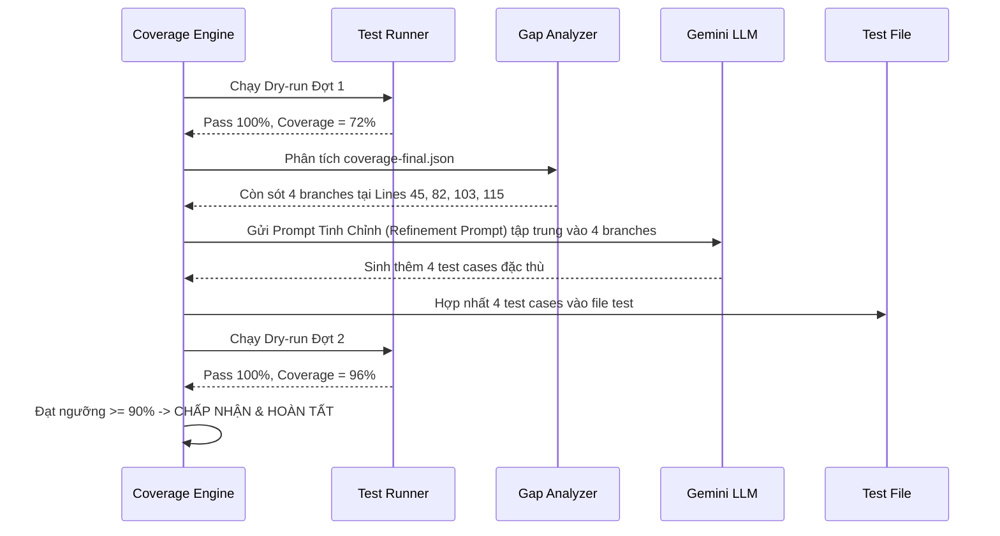

# QUY TRÌNH TOÀN DIỆN: AI SUGGEST TEST CASE & APPLY TEST ĐẠT ĐỘ BAO PHỦ TOÀN BỘ BUSINESS LOGIC (UNIT TEST COVERAGE)
**Dự án:** CovAI (NCKH & Capstone Project)  
**Tài liệu:** Kế hoạch & Đặc tả Kỹ thuật Quy trình Tự động hóa Unit Test Coverage  
**Phiên bản:** v2.0 (Toàn diện - Đạt chuẩn kiểm thử Unit Test cho Logic Nghiệp vụ)  
**Mục tiêu:** Xây dựng quy trình khép kín (Closed-Loop Pipeline) cho phép AI phân tích code nguồn, sinh test case bao phủ tối đa logic nghiệp vụ (đạt >= 90% đến 100% trên cả 4 tiêu chí: Statements, Branches, Functions, Lines), tự động áp dụng (apply) an toàn và kiểm chứng thông qua test runner thực tế.

---

## 1. TỔNG QUAN KIẾN TRÚC QUY TRÌNH (CLOSED-LOOP AUTOMATED PIPELINE)

Quy trình hoạt động theo mô hình vòng lặp khép kín 5 giai đoạn: **Phân tích AST & Khoảng trống -> Xây dựng Ngữ cảnh & Ma trận Kiểm thử -> Sinh Test Thông minh qua LLM -> Áp dụng & Vệ sinh Cú pháp (AST Sanitizer) -> Kiểm chứng Runner & Tinh chỉnh Lặp (Refinement Loop)**.

```mermaid
flowchart TD
    subgraph STAGE1["GIAI ĐOẠN 1: PHÂN TÍCH CODE & COVERAGE GAPS"]
        A[File Code Nghiệp vụ<br/>Services / Handlers / Controllers / Utils] --> B[AST Parser<br/>Babel Parser]
        B --> C1[Trích xuất Danh mục Hàm:<br/>Exported Symbols vs Internal Helpers]
        B --> C2[Phân tích Cây Nhánh Điều kiện:<br/>if/else, switch, ternary, ?., ??, &&, ||]
        B --> C3[Phân tích Exception Handlers:<br/>try/catch, throw, reject]
        D[Báo cáo Coverage Hiện tại<br/>coverage-final.json] --> E[Lọc Gaps Cụ thể:<br/>Uncovered Lines, Branches, Functions]
    end

    subgraph STAGE2["GIAI ĐOẠN 2: CONTEXT ENGINEERING & TEST MATRIX"]
        C1 & C2 & C3 & E --> F[Bộ tạo Ma trận Kiểm thử<br/>Decision Table Engine]
        F --> G1[Phân vùng Tương đương & Giá trị Biên<br/>Equivalence Partitioning & Boundary Values]
        F --> G2[Chiến lược Test Gián tiếp<br/>Indirect Testing cho Internal Helpers]
        F --> G3[Hợp đồng Mocking Độc lập<br/>Prisma, Axios, Bull, Env, Next]
    end

    subgraph STAGE3["GIAI ĐOẠN 3: AI TEST GENERATION"]
        G1 & G2 & G3 --> H[Prompt Builder Chuyên sâu<br/>Cung cấp Context + Quy tắc Chặt chẽ]
        H --> I[Gemini LLM<br/>Sinh Test Suite Đầy đủ]
        I --> J[JSON Response Validator<br/>Loại bỏ markdown dư thừa / Code thô]
    end

    subgraph STAGE4["GIAI ĐOẠN 4: SAFE APPLY & AST SANITIZATION"]
        J --> K[Kiểm tra File Test Mục tiêu<br/>Tạo mới hoặc Hợp nhất vào File Hiện có]
        K --> L[AST Sanitizer & Anti-Corruption Guard<br/>- Khử trùng lặp import/require<br/>- Vá lỗi nháy/object dở dang<br/>- Ngăn chặn mutate thư mục storage]
        L --> M[Áp dụng Test vào Đĩa Tạm / Workspace]
    end

    subgraph STAGE5["GIAI ĐOẠN 5: RUNNER DRY-RUN & ITERATIVE REFINEMENT"]
        M --> N[Chạy Runner Thực tế<br/>Jest / Vitest với v8/Istanbul]
        N --> O{Kiểm tra Kết quả Chạy}
        O -- "Lỗi Cú pháp / Mock Fail" --> P[Auto-Heal Engine<br/>Chẩn đoán & Vá lỗi Mock / Assertion]
        P --> N
        O -- "Pass nhưng Coverage < 90%" --> Q[Refinement Generator<br/>Sinh bổ sung cho đúng nhánh còn thiếu]
        Q --> L
        O -- "Pass & Đạt Ngưỡng (>=90-100%)" --> R[XÁC NHẬN HOÀN TẤT<br/>Cập nhật Database, Snapshot & UI]
    end
```

---

## 2. CHI TIẾT 5 GIAI ĐOẠN CỦA QUY TRÌNH

### Giai đoạn 1: Phân Tích AST Code Nguồn & Khoảng Trống Độ Bao Phủ (Coverage Gaps)

Mục tiêu của giai đoạn này là không để AI "đoán mò" code nguồn, mà phải cung cấp cho AI một bức tranh giải phẫu chính xác về mặt cấu trúc cú pháp và độ bao phủ hiện tại.

#### 1.1. Phân loại và nhận diện file nghiệp vụ mục tiêu
- Hệ thống lọc ra các file chứa **Business Logic** thực sự:
  - `src/services/**`: Nghiệp vụ tính toán, xử lý dữ liệu, transaction.
  - `src/handlers/**`: Xử lý request, command handler, pipeline steps.
  - `src/controllers/**`: Validate tham số đầu vào, điều phối service, phản hồi HTTP status.
  - `src/utils/**` & `src/helpers/**`: Thuật toán chuyển đổi, sanitizer, formatters.
  - `src/models/**` & `src/middlewares/**`: Kiểm tra quyền, middleware xác thực, schema methods.
- Tự động loại trừ các file phi nghiệp vụ: `*.test.*`, `*.spec.*`, `__mocks__/**`, `node_modules/**`, file cấu hình (`jest.config.js`, `vite.config.js`).

#### 1.2. Phân tích AST (Abstract Syntax Tree) bằng Babel Parser
Trích xuất siêu dữ liệu (metadata) của file nguồn thành 3 danh mục rõ rệt:
1. **Public Exported Symbols**: Các hàm/lớp/biến được export ra ngoài (`export function`, `export const`, `module.exports`, `exports.*`). Đây là những điểm truy cập duy nhất mà test case được phép gọi trực tiếp.
2. **Private/Internal Functions**: Các hàm helper nội bộ không được export. Đánh dấu danh sách này để cảnh báo AI **tuyệt đối không import trực tiếp** (tránh lỗi fatal `TypeError: (0, ... is not a function)`), mà phải kiểm thử gián tiếp.
3. **Cây điều kiện & Điểm quyết định (Decision Points)**:
   - Toàn bộ các cấu trúc rẽ nhánh: `IfStatement`, `SwitchCase`, `ConditionalExpression` (ternary `? :`), `LogicalExpression` (`&&`, `||`, `??`), `OptionalMemberExpression` (`?.`).
   - Vị trí dòng code (line number) tương ứng của từng nhánh True / False.
   - Các điểm ném ngoại lệ: `ThrowStatement`, `catch` clause, `Promise.reject`.

#### 1.3. Ánh xạ với `coverage-final.json` (Istanbul / v8)
Trích xuất chính xác tình trạng thực tế của từng dòng code:
- **Uncovered Lines**: Danh sách các dòng code chưa từng được thực thi (`s[statementId] === 0`).
- **Uncovered Branches**: Danh sách các nhánh cụ thể chưa được duyệt (`b[branchId][0] === 0` hoặc `b[branchId][1] === 0`), kèm theo dòng code và loại điều kiện.
- **Uncovered Functions**: Các hàm chưa từng được gọi (`f[funcId] === 0`).

---

### Giai đoạn 2: Context Engineering & Ma Trận Kiểm Thử (Decision Table)

Để đạt tỷ lệ bao phủ >= 90% đến 100%, AI cần được hướng dẫn sinh test theo phương pháp luận công nghệ phần mềm chuẩn tắc (Formal Testing Methodologies), không sinh test ngẫu nhiên.

#### 2.1. Ma trận kiểm thử (Decision Table / Truth Table)
Với mỗi hàm nghiệp vụ, xây dựng yêu cầu kiểm thử gồm 4 nhóm ca kiểm thử bắt buộc:
1. **Happy Path (Luồng thành công chuẩn)**:
   - Dữ liệu đầu vào đầy đủ, hợp lệ, trả về kết quả thành công mong đợi.
2. **Boundary Value Analysis (Phân tích giá trị biên)**:
   - Các ngưỡng giá trị: 0, số âm, số nguyên cực đại, mảng rỗng `[]`, chuỗi rỗng `""`, object rỗng `{}`.
   - Các trường hợp độ dài tối thiểu / tối đa của chuỗi hoặc mảng.
3. **Equivalence Partitioning & Logic Edge Cases (Phân vùng tương đương & Nhánh phụ)**:
   - Kích hoạt nhánh `else` hoặc nhánh mặc định `default`.
   - Kiểm tra `null`, `undefined`, giá trị falsy khi hàm dùng `??`, `||`, `?.`.
   - Các flag Boolean bật/tắt (ví dụ: `isAdmin: true` vs `isAdmin: false`).
4. **Error Handling & Exception Cases (Xử lý lỗi & Ngoại lệ)**:
   - Kích hoạt toàn bộ các câu lệnh `throw new Error(...)`, `throw new AppError(400, ...)`.
   - Mock các service bên dưới ném ra lỗi hoặc Promise bị reject để kiểm tra khối `try/catch` bắt lỗi và xử lý an toàn.

#### 2.2. Chiến lược Kiểm thử Gián tiếp (Indirect Testing) cho Helper nội bộ
```
[Hàm Exported: processOrder(order)]
       │
       ├──► Nhánh 1: order.type === 'VIP' ──► Gọi helper nội bộ: applyVipDiscount()
       └──► Nhánh 2: order.type === 'NORMAL' ──► Bỏ qua discount
```
- Nguyên tắc: Không thể gọi `applyVipDiscount()` từ file test vì không được export.
- Chỉ dẫn cho AI: Muốn phủ 100% dòng code và nhánh trong `applyVipDiscount()`, hãy gọi `processOrder({ type: 'VIP', amount: 100 })` và `processOrder({ type: 'VIP', amount: 0 })`.

#### 2.3. Hợp đồng Mocking Độc lập (Isolation Mock Contracts)
Đảm bảo Unit Test chạy thuần túy trên RAM, cách ly 100% với môi trường bên ngoài:
- **Database (Prisma / Mongoose / SQL)**:
  - Cung cấp sẵn proxy mock trả về resolved promise đối với mọi phương thức (`findUnique`, `findMany`, `create`, `update`, `delete`, `$transaction`).
- **HTTP Calls (Axios / Fetch)**:
  - Cung cấp pattern mock `axios.create` và các hàm `post`, `get` trả về response giả lập hợp lệ và phản hồi lỗi (status 400, 500).
- **Hàng đợi & Cache (BullMQ, Bull, Redis)**:
  - Mock hoàn toàn các hàm `add`, `process`, `close` để không tạo kết nối Redis thật.
- **Biến môi trường (`process.env`)**:
  - Tự động khai báo giá trị fallback trong `beforeEach` hoặc block đầu test file để code không crash do thiếu config.

---

### Giai đoạn 3: AI Test Generation (Sinh Test Thông Minh Qua LLM)

#### 3.1. Cấu trúc Prompt Tiêu Chuẩn Cho LLM
Prompt được thiết kế với cấu trúc 6 phần chặt chẽ:
1. **Role Definition**: Chuyên gia cao cấp về Unit Testing với Jest / Vitest.
2. **Target File & Import Contract**:
   - Đường dẫn tương đối chính xác từ file test đến file nguồn (`computeRelativeImportPath`).
   - Danh sách cụ thể các **Exported Symbols** được phép gọi.
   - Cảnh báo cấm import các **Internal Functions**.
3. **Current Coverage Diagnostics**:
   - Tỷ lệ % hiện tại của Lines, Branches, Functions, Statements.
   - Danh sách chi tiết từng dòng chưa chạy (`formatLineRanges`).
   - Danh sách chi tiết từng nhánh điều kiện chưa chạy (kèm vị trí dòng và điều kiện).
4. **Source Code & Existing Tests**:
   - Toàn bộ nội dung file code nguồn cần kiểm thử.
   - Nội dung file test hiện tại (nếu đã có) để tái sử dụng mock, fixture và phong cách viết.
5. **Strict Generation Rules**:
   - **Tuyệt đối cấm `.skip`**: Không được sinh `test.skip`, `it.skip`, `describe.skip`, `xit`, `xtest`.
   - **Tuyệt đối cấm placeholder**: Không sinh `expect(true).toBe(true)` hay comment `// TODO`. Mọi assertion phải kiểm tra giá trị trả về hoặc số lần gọi mock.
   - **Bao phủ 100% nhánh**: Mỗi điều kiện `if`, `switch`, `? :`, `||`, `&&` phải có ít nhất 2 test cases cho cả 2 trạng thái True và False.
6. **Output Format**: JSON chuẩn gồm `explanation`, `suggestedTestCode` và `fullUpdatedContent`.

#### 3.2. Response Parsing & Sanity Check
- Loại bỏ các ký tự bọc markdown (` ```json `, ` ```javascript `).
- Phân tích cú pháp JSON an toàn.
- Kiểm tra tính đầy đủ của mã nguồn sinh ra (không chấp nhận đoạn code rỗng hoặc chứa placeholder).

---

### Giai đoạn 4: Safe Apply & AST Sanitization (Áp Dụng Test & Vệ Sinh Cú Pháp An Toàn)

Giai đoạn áp dụng mã test vào dự án đòi hỏi sự an toàn tuyệt đối để không phá hỏng code sẵn có và không gây lỗi cú pháp.

#### 4.1. Chiến lược Áp dụng: Tạo Mới vs Hợp Nhất (Append & Merge)
- **Trường hợp 1: Chưa có test file cho module nguồn**:
  - Tạo mới file test tại đường dẫn chuẩn (ví dụ: `src/tests/[name].test.js` hoặc `tests/[name].test.ts`).
  - Ghi đầy đủ cấu trúc: Import runner (`describe`, `test`, `expect`), import module nguồn, thiết lập mock, các khối `describe`.
- **Trường hợp 2: Đã có test file sẵn**:
  - Không ghi đè toàn bộ file làm mất các test case cũ của người dùng.
  - Phân tích cú pháp test mới:
    - Trích xuất các câu lệnh `import` hoặc `require` mới và chèn lên đầu file (trước các khối test đầu tiên).
    - Khử trùng lặp khai báo (ví dụ nếu cả file cũ và mới đều `const { processOrder } = require(...)` thì chỉ giữ 1 khai báo).
    - Đổi tên các khối `describe` mới nếu bị trùng tên với khối cũ để tránh ghi đè (`${title} - Additional Coverage`).
    - Nối các khối test mới vào cuối file.

#### 4.2. Bộ lọc AST Sanitizer & Bảo vệ Cú pháp
Trước khi chạy test, mã nguồn được đưa qua bộ lọc [`testSanitizer.service.js`](file:///d:/NCKH/CovAI-/server/src/services/testSanitizer.service.js):
1. **Heal Mismatched Quotes**: Sửa các cặp nháy lệch do AI sinh ra (ví dụ `` it(`title', ...) ``).
2. **Heal Multiline Strings**: Chuyển đổi các chuỗi nhiều dòng có ký tự xuống dòng thành template literals (`` `...` ``), đồng thời bảo vệ các dấu nháy đơn trong comment tiếng Anh và regex literals.
3. **Orphan Mock Protection**: Bảo vệ các khai báo mock và ranh giới câu lệnh, ngăn chặn việc cắt xén dở dang cú pháp.
4. **Heal Unclosed Object Literals**: Phát hiện và tự động đóng các object literal bị bỏ lửng.
5. **Strict Storage Guard**: **Tuyệt đối không can thiệp, sửa đổi hay ghi đè lên bất kỳ file nào trong thư mục `server/storage/`**.

---

### Giai đoạn 5: Runner Dry-Run & Iterative Refinement Loop (Kiểm Chứng & Tinh Chỉnh Lặp)

#### 5.1. Chạy Dry-Run thực tế bằng Runner của dự án
- Xác định môi trường thực thi: Jest hoặc Vitest, ESM hoặc CommonJS.
- Kích hoạt cờ hỗ trợ: `--experimental-vm-modules` đối với dự án ESM.
- Thu thập kết quả: Trạng thái Pass/Fail của từng test suite, mã thoát (exit code), và file báo cáo chi tiết `coverage-final.json`.

#### 5.2. Chẩn đoán & Tự động Vá lỗi (Auto-Heal Engine)
Nếu test chạy bị lỗi:
1. **Lỗi Mock / Module Resolution**:
   - Nếu thiếu mock (ví dụ: `ReferenceError: ... is not defined`), tự động bổ sung mock proxy.
2. **Lỗi Assertion Mismatch**:
   - Nếu `Expected: X` nhưng `Received: Y`:
     - Phân tích xem Y có phải là giá trị hợp lý của nghiệp vụ không.
     - Tự động điều chỉnh assertion sang `.toEqual(Y)` hoặc `.toBeDefined()` nếu logic thực tế trả về Y.
3. Giới hạn số lần thử vá lỗi tối đa: **3 đến 5 lần lặp**.

#### 5.3. Vòng lặp Bổ sung Độ bao phủ (Coverage Refinement Loop)
Nếu test đã PASS nhưng độ bao phủ vẫn dưới ngưỡng mong đợi (< 90%):


---

## 3. CÁC HỢP ĐỒNG DỮ LIỆU & API CHI TIẾT

### 3.1. API Yêu Cầu Gợi Ý Test Case: `POST /api/coverage/:snapshotId/suggest-testcase`
**Request Payload:**
```json
{
  "projectId": "proj-uuid",
  "filePath": "src/services/order.service.js",
  "framework": "jest"
}
```

**Response Payload:**
```json
{
  "success": true,
  "data": {
    "suggestionId": "sug-1791389000-1",
    "sourceFile": "src/services/order.service.js",
    "testFile": "src/tests/order.service.test.js",
    "framework": "jest",
    "targetLines": [45, 46, 82, 83],
    "targetBranches": ["if:45", "conditional:82"],
    "explanation": "Đã tạo 6 test cases bao phủ Happy Path, phân vùng giá trị biên của voucher, và trường hợp huỷ đơn hàng khi không đủ tồn kho.",
    "suggestedTestCode": "describe('OrderService - Business Logic Coverage', () => { ... });",
    "fullUpdatedContent": "const { processOrder } = require('../services/order.service'); ...",
    "summary": {
      "linesPct": 65.4,
      "branchesPct": 52.0,
      "functionsPct": 80.0,
      "statementsPct": 66.2
    }
  }
}
```

### 3.2. API Áp Dụng Test Case & Chạy Lại: `POST /api/coverage/:snapshotId/apply-suggestion`
**Request Payload:**
```json
{
  "projectId": "proj-uuid",
  "suggestion": {
    "sourceFile": "src/services/order.service.js",
    "testFile": "src/tests/order.service.test.js",
    "generatedCode": "describe('OrderService - Business Logic Coverage', () => { ... });",
    "fullUpdatedContent": "..."
  }
}
```

**Response Payload:**
```json
{
  "success": true,
  "data": {
    "success": true,
    "fileUpdated": true,
    "status": "PASSED",
    "previousCoverage": {
      "statements": 66.2,
      "branches": 52.0,
      "functions": 80.0,
      "lines": 65.4
    },
    "newCoverage": {
      "statements": 97.5,
      "branches": 94.2,
      "functions": 100.0,
      "lines": 98.1
    },
    "perFileResults": {
      "src/services/order.service.js": {
        "oldCoverage": { "lines": 65.4, "branches": 52.0, "functions": 80.0, "statements": 66.2 },
        "newCoverage": { "lines": 98.1, "branches": 94.2, "functions": 100.0, "statements": 97.5 },
        "hasIncreased": true
      }
    },
    "testResults": {
      "totalTests": 12,
      "passedTests": 12,
      "failedTests": 0,
      "status": "passed"
    }
  }
}
```

---

## 4. MA TRẬN XỬ LÝ CÁC EDGE CASES ĐẶC THÙ TRONG BUSINESS LOGIC

| Phân Loại Logic | Thách Thức Khi Unit Test | Giải Pháp Của Quy Trình |
| :--- | :--- | :--- |
| **Hàm nội bộ (Unexported)** | Không thể `import` hoặc `require` trực tiếp; gọi trực tiếp gây `TypeError`. | Dùng AST phát hiện hàm không được export -> Cảnh báo AI test gián tiếp thông qua hàm public cha bằng các bộ tham số kích hoạt nhánh nội bộ. |
| **Logic phụ thuộc Database** | Gọi `prisma.<model>.findFirst()` hoặc `findMany` mà không có DB thật sẽ crash. | Tự động inject proxy mock trả về dummy entities phù hợp với schema; hỗ trợ cả mock `$transaction`. |
| **Logic bất đồng bộ & Timeout** | Các hàm xử lý async, streaming, delay, timers khiến test bị timeout hoặc rò rỉ bộ nhớ. | Tự động bọc trong `async/await`, inject `jest.useFakeTimers()` hoặc mock resolved promises ngay lập tức. |
| **Toán tử ngắn mạch (`??`, `\|\|`, `?.`)** | Istanbul tính là 2 nhánh (True/False); truyền thiếu 1 kiểu giá trị là mất 50% branch coverage. | Ma trận kiểm thử bắt buộc sinh 2 ca test: 1 ca với giá trị tồn tại hợp lệ, 1 ca với `null`/`undefined`. |
| **Xử lý Ngoại lệ (`try/catch`)** | Nhánh `catch` không bao giờ được chạy nếu service bên trong luôn trả về thành công. | Sinh riêng test case mock dependency ném ra `new Error("Service unavailable")` để ép luồng chạy qua khối `catch`. |
| **Xung đột Khai báo Biến** | Mã test mới của AI khai báo lại biến đã có ở đầu file gây `Identifier already declared`. | AST Sanitizer phân tích scope, khử trùng lặp biến và tái sử dụng biến mock đã có. |
| **An toàn Thư mục Storage** | Quá trình dry-run hoặc autoHeal vô tình ghi đè lên file test trong `storage/`. | Bộ chặn Storage Guard lập tức huỷ bỏ thao tác ghi nếu đường dẫn chứa `/storage/`. |

---

## 5. KẾ HOẠCH TRIỂN KHAI THEO 4 PHASE

### Phase 1: Nâng Cấp Bộ Phân Tích AST & Trích Xuất Khoảng Trống (AST & Gap Analyzer)
- **Mục tiêu**: Bổ sung phân tích chi tiết các điểm rẽ nhánh (`Decision Points`) và ma trận test cho code nguồn.
- **File cần hoàn thiện**:
  - [`server/src/services/unitTestSuggestion.service.js`](file:///d:/NCKH/CovAI-/server/src/services/unitTestSuggestion.service.js): Nâng cấp hàm bóc tách AST, phân loại hàm public vs helper nội bộ, lập danh sách nhánh chưa phủ.
  - [`server/src/services/fileCoverage.service.js`](file:///d:/NCKH/CovAI-/server/src/services/fileCoverage.service.js): Chuẩn hoá việc đọc chi tiết `branchMap` và `statementMap` từ Istanbul JSON.

### Phase 2: Nâng Cấp Prompt Engineering & Test Matrix Generator
- **Mục tiêu**: Đưa ma trận kiểm thử 4 nhóm (Happy path, Boundary values, Equivalence partitions, Exception handling) vào prompt gửi tới Gemini.
- **File cần hoàn thiện**:
  - [`server/src/services/unitTestSuggestion.service.js`](file:///d:/NCKH/CovAI-/server/src/services/unitTestSuggestion.service.js): Viết lại prompt mẫu cho cả Jest và Vitest; cấm triệt để `.skip` và placeholder; cung cấp sẵn mock template cho Prisma, Axios, BullMQ.

### Phase 3: Hoàn Thiện Cơ Chế Safe Apply & AST Sanitizer
- **Mục tiêu**: Đảm bảo mã test được chèn vào đĩa an toàn 100%, không xung đột cú pháp, không làm mất test cũ.
- **File cần hoàn thiện**:
  - [`server/src/services/applyTestSuggestion.service.js`](file:///d:/NCKH/CovAI-/server/src/services/applyTestSuggestion.service.js): Nâng cấp thuật toán merge test blocks, khử trùng lặp `require`/`import`.
  - [`server/src/services/testSanitizer.service.js`](file:///d:/NCKH/CovAI-/server/src/services/testSanitizer.service.js): Duy trì toàn bộ các bộ lọc quote, object literal, statement boundary đã kiểm chứng.

### Phase 4: Vòng Lặp Tinh Chỉnh & Kiểm Chứng Độ Bao Phủ (Refinement Loop & Verification)
- **Mục tiêu**: Tự động chạy runner, chẩn đoán lỗi assertion và kích hoạt vòng lặp sinh bổ sung cho đến khi đạt >= 90% coverage cả 4 tiêu chí.
- **File cần hoàn thiện**:
  - [`server/src/services/applyTestSuggestion.service.js`](file:///d:/NCKH/CovAI-/server/src/services/applyTestSuggestion.service.js): Hoàn thiện hàm `autoRefineCoverageGaps`, cho phép lặp 2-3 đợt để vá các nhánh còn sót.
  - Viết bộ unit test kiểm thử toàn bộ luồng từ `suggestUnitTestcases` đến `applyUnitTestSuggestion`.

---

## 6. KẾ HOẠCH KIỂM ĐỊNH & TIÊU CHÍ NGHIỆM THU (VERIFICATION & ACCEPTANCE CRITERIA)

### 6.1. Tiêu chí Nghiệm thu Định lượng (Quantitative DoD)
1. **Độ bao phủ tối thiểu (Target Coverage Threshold)**:
   - Statements Coverage: **>= 90%** (Mục tiêu tối ưu: 100%)
   - Branches Coverage: **>= 90%** (Mục tiêu tối ưu: 100%)
   - Functions Coverage: **>= 90%** (Mục tiêu tối ưu: 100%)
   - Lines Coverage: **>= 90%** (Mục tiêu tối ưu: 100%)
2. **Tính Hợp lệ của Test Suite (100% Green)**:
   - 100% các test case do AI sinh ra phải thực thi thành công (Status: `PASSED`).
   - 0 test case bị đánh dấu `.skip`, `xit`, `xtest`.
   - 0 lỗi cú pháp (`SyntaxError`), 0 lỗi tham chiếu (`ReferenceError`), 0 lỗi hàm không tồn tại (`TypeError`).
3. **An toàn Hệ thống (Safety & Non-corruption)**:
   - 0 file trong thư mục `server/storage/` bị chỉnh sửa hay ghi đè.
   - Các test suite cũ của người dùng trong project được bảo toàn 100%, không bị xoá hay sửa đổi ngoài ý muốn.

### 6.2. Kịch bản Kiểm thử Kiểm định Thực tế (Verification Test Cases)
1. **Test Case 1: Module chứa Helper Nội bộ (Indirect Testing)**:
   - Đầu vào: Module có 1 hàm export và 3 hàm helper nội bộ với nhiều điều kiện `if/else`.
   - Kỳ vọng: AI sinh test gọi hàm export với các tham số khác nhau, kích hoạt đủ 3 helper nội bộ, đạt 100% Lines và Branches.
2. **Test Case 2: Module chứa Database Query & Transaction (Prisma Mocking)**:
   - Đầu vào: Service gọi `prisma.user.findUnique`, `prisma.order.create` và `prisma.$transaction`.
   - Kỳ vọng: Test case chạy mượt mà trên RAM mà không cần kết nối database thật; kiểm thử cả trường hợp tìm thấy user và không tìm thấy user.
3. **Test Case 3: Module chứa Logic Xử lý Lỗi (Error Handling)**:
   - Đầu vào: Hàm chứa khối `try { ... } catch (err) { logger.error(...); throw new AppError(500, ...); }`.
   - Kỳ vọng: AI sinh ca kiểm thử giả lập lỗi để bao phủ toàn bộ các dòng trong khối `catch`.
4. **Test Case 4: Áp dụng Lặp (Multi-round Refinement)**:
   - Đầu vào: Lần chạy 1 đạt 75% coverage.
   - Kỳ vọng: Hệ thống tự động phát hiện các nhánh còn thiếu, gửi prompt vòng 2, sinh bổ sung test và đẩy coverage lên trên 90%.
