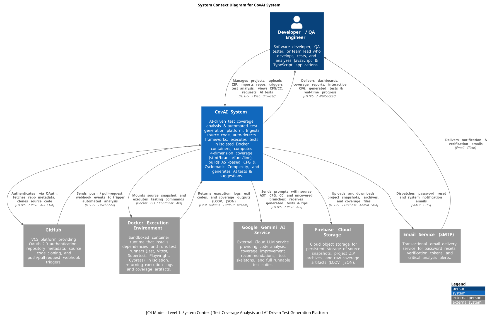

# CovAI System Context



This System Context Diagram (Level 1 in the C4 Model / ISO/IEC/IEEE 42010 standard) establishes the boundary and external relationships for the **CovAI** software system as specified in `specs/C1SE.30_Proposal_ver1.1.docx` and realized in the project codebase.

---

## 1. System Context Overview

| Element | Type | Role & Description | Key Interactions / Protocols |
| :--- | :--- | :--- | :--- |
| **Developer / QA** | Person | Primary user (Developer, QA Engineer, Tech Lead) who develops, tests, and analyzes JavaScript & TypeScript applications. | • Manages projects and snapshots<br>• Uploads ZIP / imports GitHub repo<br>• Triggers test analysis & reviews CFG / CC metrics<br>• Requests AI-driven test generation (`HTTPS / Web Browser`) |
| **CovAI System** | Software System | Central AI-driven test coverage analysis and automated test generation platform (**System Under Study**). | • Manages ingestion and snapshots<br>• Detects test frameworks automatically<br>• Orchestrates containerized test executions<br>• Computes 4-dimension coverage (stmt/branch/func/line)<br>• Analyzes AST, CFG & Cyclomatic Complexity<br>• Prompts Gemini LLM for test generation & quality tips<br>• Delivers real-time WebSocket progress updates |
| **GitHub** | External System | Remote Version Control System (VCS) hosting platform. | • User OAuth 2.0 authentication<br>• Repository metadata & source code clone (`HTTPS / REST API / Git`)<br>• Sends Push/PR Webhooks to trigger automated analysis (`HTTPS / Webhook`) |
| **Docker Execution Environment** | External System | Sandboxed container runtime for safe dependency installation and test execution. | • Installs project dependencies (`npm install` / `yarn`)<br>• Executes Jest, Vitest, Supertest, Playwright, Cypress<br>• Streams stdout/stderr logs and returns LCOV/JSON coverage files (`Docker CLI / Volume Mount`) |
| **Google Gemini AI Service** | External System | Cloud Large Language Model (LLM) API. | • Receives bounded source code, AST, CFG, and uncovered branch data<br>• Generates test skeletons (`describe`/`test`), full runnable tests, and code quality recommendations (`HTTPS / Gemini REST API`) |
| **Firebase Cloud Storage** | External System | Cloud object storage for persistent snapshot storage. | • Persists project ZIP archives, source snapshots, and raw coverage outputs (`HTTPS / Firebase Admin SDK`) |
| **Email Service (SMTP)** | External System | Transactional mail provider. | • Dispatches account verification, password resets, and critical analysis alerts (`SMTP / TLS`) |

---

## 2. Supported Scope & Capabilities (C1SE.30 Proposal)

- **Target Ecosystem:** JavaScript / TypeScript (Node.js & Web Applications).
- **Supported Testing Levels & Frameworks:**
  - **Unit Testing:** Jest, Vitest
  - **Integration Testing:** Supertest, Playwright
  - **System / E2E Testing:** Playwright, Cypress
- **Static & Dynamic Analysis:**
  - Control Flow Graph (CFG) via Babel Parser AST traversal.
  - Cyclomatic Complexity (CC) calculation at function and file levels.
  - Code hygiene inspection (debug leftovers, security flags, quality scoring).
- **AI-Assisted Capabilities:**
  - Test Skeleton Generation (`describe` / `test` signatures).
  - Full Runnable Test Generation (with `test.todo` fallback mechanism).
  - Automated coverage improvement recommendations.

---

## 3. PlantUML Source Code

The diagram source is maintained in two standard formats:

### Option A: Standalone PlantUML (Offline / Zero-Dependency)
Located in [`docs/architecture/diagrams/covai-system-context.puml`](diagrams/covai-system-context.puml). Can be compiled directly in any offline environment without internet access.

```plantuml
@startuml CovAI_System_Context
title System Context Diagram for CovAI System
caption [C4 Model - Level 1: System Context] Based on C1SE.30 Proposal v1.1 & Repository Architecture
left to right direction

skinparam monochrome true
skinparam shadowing false
skinparam roundCorner 4
skinparam linetype ortho
skinparam nodesep 70
skinparam ranksep 100
skinparam padding 12
skinparam defaultFontName "Segoe UI", Arial, sans-serif
skinparam defaultFontSize 12
skinparam defaultTextAlignment center

skinparam ArrowFontName "Segoe UI", Arial, sans-serif
skinparam ArrowFontSize 11
skinparam ArrowThickness 1.2
skinparam ArrowColor #222222

skinparam rectangle {
    BackgroundColor #FFFFFF
    BorderColor #222222
    FontColor #111111
    BorderThickness 1.2
    Padding 14
}

skinparam actor {
    BackgroundColor #FFFFFF
    BorderColor #222222
    FontColor #111111
    BorderThickness 1.5
}

actor "<b>Developer / QA Engineer</b>\n<size:10>[Person]</size>\n\nSoftware developer or tester who develops,\ntests, and analyzes JavaScript software projects." as Developer

rectangle "==<b>CovAI System</b>\n<size:10>[Software System - System of Interest]</size>\n\nAI-driven test coverage analysis and automated test generation\nplatform. Manages projects and snapshots, auto-detects testing\nframeworks, coordinates isolated test execution, measures multi-level\ncoverage (stmt/branch/func/line), computes AST-based CFG and\nCyclomatic Complexity, and generates AI tests & suggestions." as CovAI <<System>>

rectangle "<b>GitHub</b>\n<size:10>[External Software System]</size>\n\nVCS platform providing OAuth authentication,\nsource code repositories, and webhook events." as GitHub <<External>>

rectangle "<b>Docker Execution Environment</b>\n<size:10>[External Software System / Runtime]</size>\n\nSandboxed container runtime that installs project\ndependencies and executes test runners (Jest, Vitest,\nSupertest, Playwright, Cypress) in isolation." as Docker <<External>>

rectangle "<b>Google Gemini AI Service</b>\n<size:10>[External Software System / AI LLM]</size>\n\nCloud LLM API that receives source code context,\nAST, CFG, and coverage gaps to generate test\nskeletons, full tests, and improvement suggestions." as Gemini <<External>>

rectangle "<b>Firebase Cloud Storage</b>\n<size:10>[External Software System / Cloud Storage]</size>\n\nObject storage for persisting source snapshots,\nuploaded ZIP packages, and raw coverage artifacts." as Firebase <<External>>

rectangle "<b>Email Service (SMTP)</b>\n<size:10>[External Software System / Mailer]</size>\n\nTransactional email service delivering password reset\ntokens, verification emails, and analysis alerts." as Email <<External>>

Developer -right-> CovAI : [1] Manages projects, uploads ZIP, connects repos,\ntriggers test runs, views coverage & CFG, and requests AI tests\n<size:10>[HTTPS / Web Browser]</size>
CovAI -left-> Developer : [2] Delivers real-time job progress, coverage metrics,\nCFG interactive graphs, and generated test suites\n<size:10>[HTTPS / WebSocket]</size>

CovAI <--> GitHub : [3] Authenticates via OAuth 2.0, fetches repo metadata,\nand clones source code snapshots\n<size:10>[HTTPS / REST API / Git]</size>
GitHub -down-> CovAI : [4] Sends push/pull-request webhook events to trigger automated analysis\n<size:10>[HTTPS / Webhook]</size>

CovAI -right-> Docker : [5] Mounts snapshot workspace, passes framework commands,\nand invokes isolated test execution\n<size:10>[Docker CLI / Container API]</size>
Docker -left-> CovAI : [6] Streams stdout/stderr logs, returns exit codes,\nand produces coverage output (LCOV, JSON)\n<size:10>[Host Volume / IPC Stream]</size>

CovAI <--> Gemini : [7] Sends prompt contexts (source code, uncovered branches, CFG, CC)\nand receives test skeletons, runnable tests, and code suggestions\n<size:10>[HTTPS / Gemini REST API]</size>

CovAI <--> Firebase : [8] Uploads and retrieves project archives, snapshot bundles,\nand raw coverage report files\n<size:10>[HTTPS / Firebase Admin SDK]</size>

CovAI -up-> Email : [9] Dispatches password reset and system alert emails\n<size:10>[SMTP / TLS]</size>
Email -left-> Developer : [10] Delivers notification & verification emails\n<size:10>[Email Client]</size>

GitHub -[hidden]down-> Docker
Docker -[hidden]down-> Gemini
Gemini -[hidden]down-> Firebase

@enduml
```



### Option B: Official C4-PlantUML Syntax (`C4_Context.puml`)

```plantuml
@startuml CovAI_C4_System_Context
!include https://raw.githubusercontent.com/plantuml-stdlib/C4-PlantUML/master/C4_Context.puml

LAYOUT_WITH_LEGEND()

title System Context Diagram for CovAI System

Person(developer, "Developer / QA Engineer", "Software developer, QA tester, or team lead who builds, analyzes, and tests JavaScript and TypeScript applications.")

System(covai, "CovAI System", "AI-driven test coverage analysis and automated test generation platform. Ingests source code, auto-detects frameworks, executes tests in isolated Docker containers, computes 4-dimension coverage, builds CFG & Cyclomatic Complexity, and generates AI tests.")

System_Ext(github, "GitHub", "VCS platform providing OAuth 2.0 authentication, repository metadata, source code cloning, and push/pull-request webhook triggers.")
System_Ext(docker, "Docker Execution Environment", "Sandboxed container runtime that installs dependencies and runs test runners (Jest, Vitest, Supertest, Playwright, Cypress) in isolation.")
System_Ext(gemini, "Google Gemini AI Service", "External LLM service providing code analysis, coverage improvement recommendations, test skeletons, and full runnable test suites.")
System_Ext(firebase, "Firebase Cloud Storage", "Cloud object storage for persistent storage of source snapshots, project ZIP archives, and raw coverage artifacts.")
System_Ext(email, "Email Service (SMTP)", "Transactional email delivery service for password resets, verification tokens, and analysis alerts.")

Rel(developer, covai, "Manages projects, uploads ZIP, imports repos, triggers test analysis, views CFG/CC, requests AI tests", "HTTPS / Web Browser")
Rel(covai, developer, "Delivers dashboards, coverage reports, interactive CFG, generated tests & real-time progress", "HTTPS / WebSocket")

Rel(covai, github, "Authenticates via OAuth, fetches repo metadata, clones source code", "HTTPS / REST API / Git")
Rel(github, covai, "Sends push / pull-request webhook events to trigger automated analysis", "HTTPS / Webhook")

Rel(covai, docker, "Mounts source snapshot and executes testing commands", "Docker CLI / Container API")
Rel(docker, covai, "Returns execution logs, exit codes, and coverage outputs (LCOV, JSON)", "File Mount / stdout stream")

Rel(covai, gemini, "Sends prompts with source AST, CFG, CC, and uncovered branches", "HTTPS / REST API")
Rel(gemini, covai, "Returns test skeletons, executable test cases, and quality suggestions", "JSON / Text")

Rel(covai, firebase, "Uploads and downloads project snapshots, archives, and coverage files", "HTTPS / Firebase Admin SDK")

Rel(covai, email, "Dispatches password reset and system notification emails", "SMTP / TLS")
Rel(email, developer, "Delivers notification & verification emails", "Email Client")

@enduml
```

---

## 4. How to Render to Image

You can compile the `.puml` file directly to `.svg` and `.png` using the provided automation script:

```powershell
# Auto-render both PNG and SVG directly from PlantUML code
python tools/render_diagrams.py
```

Or using the standard PlantUML CLI:
```powershell
# Generate high-resolution SVG
plantuml -tsvg docs/architecture/diagrams/covai-system-context.puml

# Generate PNG
plantuml -tpng docs/architecture/diagrams/covai-system-context.puml
```

The exported artifact files:
- **Draw.io Editable Diagram:** [`docs/architecture/diagrams/covai-system-context.drawio`](diagrams/covai-system-context.drawio) *(mở và chỉnh sửa trực tiếp bằng Draw.io / Diagrams.net)*
- **PNG file:** [`docs/architecture/diagrams/covai-system-context.png`](diagrams/covai-system-context.png)
- **Vector SVG file:** [`docs/architecture/diagrams/covai-system-context.svg`](diagrams/covai-system-context.svg)
- **PlantUML source:** [`docs/architecture/diagrams/covai-system-context.puml`](diagrams/covai-system-context.puml)

All files are directly embeddable or editable in Word reports, LaTeX, Google Docs, or Capstone Project slide decks.

