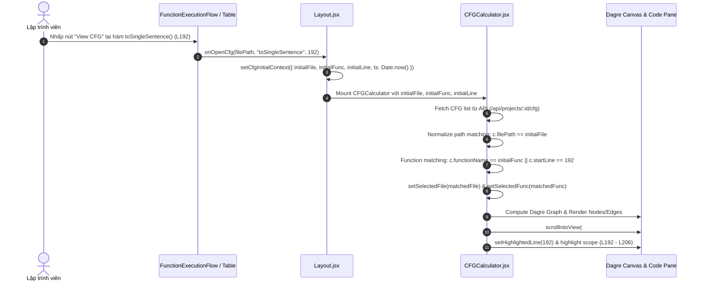
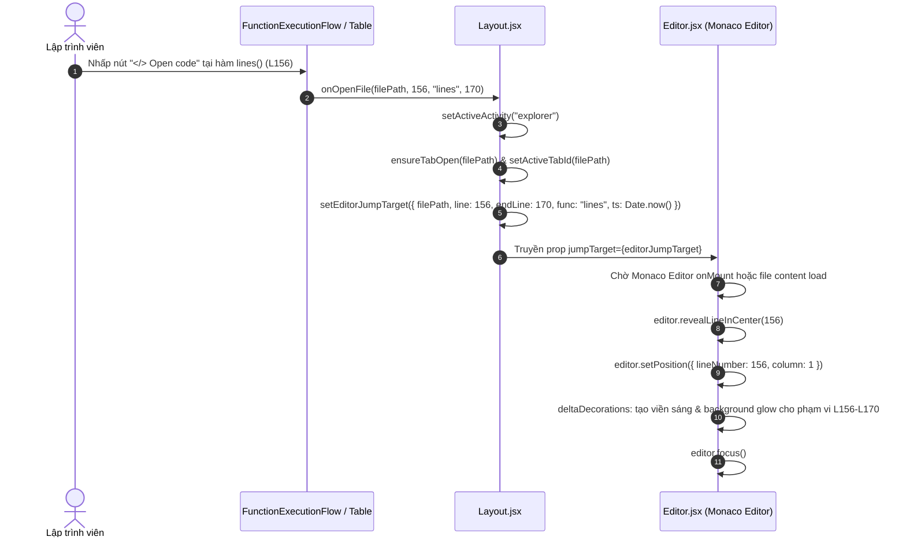
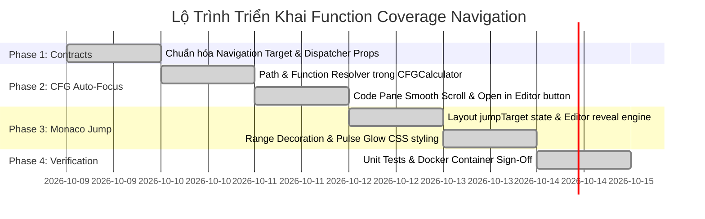

# THIẾT KẾ KIẾN TRÚC & KẾ HOẠCH TRIỂN KHAI: ĐIỀU HƯỚNG CHÍNH XÁC VÀO HÀM TỪ FUNCTION COVERAGE (VIEW CFG & OPEN CODE)

Tài liệu đặc tả kỹ thuật này thiết lập giải pháp toàn diện cho cơ chế **Điều Hướng Chính Xác Vào Hàm (Precise Function-Level Navigation Engine)** trong hệ thống CovAI-. Giải pháp cho phép khi lập trình viên bấm **"View CFG"** hoặc **"Open code"** từ bảng phân tích Function Coverage (*Method Execution Map* và *Details Table*), giao diện sẽ tức thì định vị, mở đúng file, chọn đúng hàm, vẽ đồ thị Control Flow Graph (CFG) của chính hàm đó, đồng thời cuộn mã nguồn và tô sáng (highlight) phạm vi khối hàm trong trình soạn thảo Monaco Editor.

---

## 1. TỔNG QUAN VẤN ĐỀ & BỐI CẢNH THỰC TẾ (PROBLEM STATEMENT)

### 1.1. Bối Cảnh Phân Tích Function Coverage Trong CovAI-
Trong giao diện kiểm thử độ bao phủ (Coverage Dashboard), chỉ số **Function Coverage** đóng vai trò then chốt bên cạnh Statement và Branch Coverage:
- Nhận diện toàn bộ các phương thức/hàm trong dự án mã nguồn.
- Theo dõi tần suất thực thi định lượng (*Invocation Metrics*): số lần gọi (`hit count`), tỷ lệ bao phủ hàm gọi so với chưa gọi (`77/103 (74.8%) Called`, `26 uncalled functions`).
- Trực quan hóa bản đồ phân bổ luồng gọi (*Call Distribution Across Methods*) và từng thẻ đại diện cho hàm:
  - Thẻ hàm hiển thị: Tên hàm (`lines()`, `test()`, `toSingleSentence()`), đường dẫn file (`backend/src/services/...`), số lượt gọi (`0 hits / X hits`), và tọa độ dòng (`Line Position: L156` hoặc `L192 - L206`).
  - Hai nút hành động trọng tâm tại chân mỗi thẻ:
    1. **`</> Open code`**: Mở file mã nguồn chứa hàm để xem và chỉnh sửa trực tiếp.
    2. **`View CFG`**: Khởi chạy bộ tính toán và trực quan hóa Đồ thị dòng điều khiển (Control Flow Graph - CFG) kèm độ phức tạp Cyclomatic Complexity ($M = E - N + 2P$).

---

### 1.2. Các Khiếm Khuyết Trải Nghiệm Hiện Hữu (Current Gaps & Pain Points)

```
┌─────────────────────────────────────────────────────────────────────────────────────────────┐
│ TRẠNG THÁI HIỆN TẠI (TRƯỚC KHI TỐI ƯU):                                                    │
├─────────────────────────────────────────────────────────────────────────────────────────────┤
│                                                                                             │
│  [Thẻ Hàm: toSingleSentence() @ L192-L206]                                                  │
│                                                                                             │
│  Bấm [View CFG]  ──►  Mở CFGCalculator ──► Bị mất context hàm!                             │
│                       - Luôn load file đầu tiên của project (ví dụ: auth.service.js)        │
│                       - Để selectedFunc = null (chế độ Call Graph chung)                    │
│                       - Đồ thị trống hoặc không đúng hàm cần soi!                           │
│                       - Cột Code bên trái nằm ở Dòng 1, không cuộn đến L192!                │
│                                                                                             │
│  Bấm [Open code] ──►  Mở Monaco Editor  ──► Bị mất vị trí dòng!                             │
│                       - Chỉ nhận filePath, mở file tại Dòng 1                               │
│                       - Không cuộn đến L192, không highlight khối hàm                       │
│                       - Developer phải Ctrl+F tìm tên hàm thủ công trong file 2,000 dòng!   │
│                                                                                             │
└─────────────────────────────────────────────────────────────────────────────────────────────┘
```

#### Nguyên Nhân Kỹ Thuật:
1. **Đứt gãy tham số tại tầng View Container**:
   - Trong `client/src/components/dashboard/UnitTestDashboard.jsx`, prop được truyền là `onOpenCFG={() => setShowCFG(true)}`. Khi `CoverageTypeDashboard` gọi `onOpenCFG(filePath, funcName)`, closure này nuốt trọn tham số và chỉ bật cờ modal.
2. **Bỏ qua ngữ cảnh ban đầu trong `CFGCalculator.jsx`**:
   - Mặc dù nhận `initialFile` và `initialFunc` từ props, hàm `fetchData` của `CFGCalculator` sau khi nạp danh sách CFG từ server lại cưỡng bức:
     ```javascript
     const firstFile = [...new Set(cfgRes.data.map((c) => c.filePath))][0];
     setSelectedFile(firstFile);
     // Không hề set selectedFunc = initialFunc!
     ```
3. **Thiếu cơ chế Monaco Range Jump & Highlight**:
   - `handleOpenFileByPath(filePath)` trong `Layout.jsx` chỉ chuyển tab Explorer mà không truyền tọa độ dòng mục tiêu xuống `Editor.jsx`.
   - Monaco Editor không nhận được lệnh `revealLineInCenter` và `deltaDecorations` để đánh dấu vùng hàm.

---

### 1.3. Mục Tiêu Giải Pháp (Target UX Outcome)

```
┌─────────────────────────────────────────────────────────────────────────────────────────────┐
│ TRẠNG THÁI MỤC TIÊU (SAU KHI TRIỂN KHAI):                                                   │
├─────────────────────────────────────────────────────────────────────────────────────────────┤
│                                                                                             │
│  [Thẻ Hàm: toSingleSentence() @ L192-L206]                                                  │
│                                                                                             │
│  Bấm [View CFG]  ──►  Mở CFGCalculator ──► ĐÚNG FILE & ĐÚNG CHÍNH HÀM!                      │
│                       ✓ Tự động chọn đúng file `backend/src/services/sentence.service.js`   │
│                       ✓ Tự động kích hoạt đồ thị CFG của `toSingleSentence()`               │
│                       ✓ Cột Code tự động cuộn mượt mà đưa L192 vào giữa màn hình            │
│                       ✓ Highlight khối code L192-L206 kèm chỉ báo ▶                         │
│                       ✓ Bổ sung nút [Open in Editor] chuyển tiếp sang Monaco                │
│                                                                                             │
│  Bấm [Open code] ──►  Mở Monaco Editor  ──► NHẢY NGAY VÀO KHỐI HÀM!                         │
│                       ✓ Mở đúng file trong tab Editor                                       │
│                       ✓ Monaco tự động `revealLineInCenter(192)`                            │
│                       ✓ Đặt con trỏ soạn thảo tại đầu hàm (L192:C1)                         │
│                       ✓ Áp dụng hiệu ứng viền/nền phát sáng (Pulse Glow) trong phạm vi hàm  │
│                                                                                             │
└─────────────────────────────────────────────────────────────────────────────────────────────┘
```

---

## 2. KIẾN TRÚC ĐIỀU HƯỚNG LIÊN PHÂN HỆ (CROSS-COMPONENT NAVIGATION ARCHITECTURE)

### 2.1. Sơ Đồ Khối Luồng Dữ Liệu & Sự Kiện (Event & Data Flow)

```mermaid
graph TD
    subgraph UI_CARDS ["1. Tầng Giao Diện Thẻ Hàm (Cards & Table)"]
        FEF["FunctionExecutionFlow.jsx<br/>(Method Execution Map)"]
        CTD_Table["CoverageTypeDashboard.jsx<br/>(Details Table)"]
    end

    subgraph DISPATCHER ["2. Tầng Điều Phối Trung Tâm (Layout & Dashboards)"]
        UTD["UnitTestDashboard.jsx"]
        ITD["IntegrationTestDashboard.jsx"]
        LAYOUT["Layout.jsx<br/>- handleOpenCFG(file, func, line)<br/>- handleOpenFileByPath(file, line, func, endLine)"]
    end

    subgraph DESTINATIONS ["3. Tầng Đích Đến (CFG Engine & Monaco Editor)"]
        CFG["CFGCalculator.jsx<br/>- Auto File Normalizer<br/>- Auto Function Resolver<br/>- Dagre Layout Center<br/>- Code Pane Smooth Scroll"]
        MONACO["Editor.jsx (Monaco)<br/>- revealLineInCenter(line)<br/>- setPosition(line, 1)<br/>- Function Range Decoration<br/>- Auto Focus"]
    end

    FEF -->|onOpenFile(target)| UTD
    FEF -->|onOpenCfg(target)| UTD
    CTD_Table -->|onOpenFile(target)| UTD
    CTD_Table -->|onOpenCfg(target)| UTD

    UTD --> LAYOUT
    ITD --> LAYOUT

    LAYOUT -->|cfgInitialContext| CFG
    LAYOUT -->|editorJumpTarget| MONACO
    CFG -.->|"Open in Editor" button| MONACO
```

---

### 2.2. Sơ Đồ Tuần Tự (Sequence Diagram): Luồng Bấm "View CFG"



---

### 2.3. Sơ Đồ Tuần Tự (Sequence Diagram): Luồng Bấm "Open code"



---

## 3. THIẾT KẾ DỮ LIỆU & API CONTRACTS (DATA MODEL SPECIFICATION)

### 3.1. Hợp Đồng Dữ Liệu Điều Hướng (Navigation Target Interface)

Để đảm bảo tính nhất quán giữa tất cả các tầng, hệ thống chuẩn hóa cấu trúc đối tượng điều hướng:

```typescript
export interface FunctionNavigationTarget {
  /** Đường dẫn tương đối chuẩn hóa của file mã nguồn (e.g. "backend/src/services/sentence.service.js") */
  filePath: string;
  /** Tên định danh thực tế của hàm trích xuất từ AST hoặc Coverage (e.g. "toSingleSentence") */
  functionName: string;
  /** Tên hiển thị người dùng (e.g. "func_L156" hoặc "toSingleSentence()") */
  displayName?: string;
  /** Dòng bắt đầu định nghĩa hàm (1-indexed) */
  startLine: number;
  /** Dòng kết thúc định nghĩa hàm (1-indexed) */
  endLine?: number;
  /** Số lượt thực thi trong phiên test */
  hit?: number;
}

export interface CfgInitialContext {
  initialFile: string;
  initialFunc: string | null;
  initialLine?: number | null;
  timestamp: number;
}

export interface EditorJumpTarget {
  filePath: string;
  line: number;
  endLine?: number | null;
  functionName?: string | null;
  timestamp: number;
}
```

---

### 3.2. Thuật Toán Khớp Đường Dẫn & Tên Hàm Thông Minh (Fuzzy Matching Engine)

Vì đường dẫn file có thể chứa các biến thể (ví dụ: `backend/src/services/a.js` vs `src/services/a.js` vs `./a.js`), giải pháp áp dụng thuật toán chuẩn hóa:

```javascript
/**
 * Chuẩn hóa đường dẫn POSIX để so sánh an toàn
 */
export const normalizePathForCompare = (p) => {
  if (!p) return "";
  return p
    .replace(/\\/g, "/")
    .replace(/^\.\//, "")
    .replace(/^(?:.*?\/)?storage\/projects\/[^/]+\/[^/]+\/[^/]+\/repo\//i, "")
    .replace(/^(?:.*?\/)?repo\//i, "")
    .toLowerCase();
};

/**
 * Khớp file mục tiêu trong danh sách file CFG
 */
export const findMatchingCfgFile = (candidateFiles, targetPath) => {
  if (!targetPath || candidateFiles.length === 0) return candidateFiles[0] || null;
  const targetNorm = normalizePathForCompare(targetPath);

  // 1. Khớp chính xác hoàn toàn
  const exact = candidateFiles.find((f) => normalizePathForCompare(f) === targetNorm);
  if (exact) return exact;

  // 2. Khớp đuôi (endsWith)
  const endsWithMatch = candidateFiles.find(
    (f) => targetNorm.endsWith("/" + normalizePathForCompare(f)) ||
           normalizePathForCompare(f).endsWith("/" + targetNorm)
  );
  if (endsWithMatch) return endsWithMatch;

  // 3. Khớp basename
  const baseTarget = targetNorm.split("/").pop();
  const baseMatch = candidateFiles.find(
    (f) => normalizePathForCompare(f).split("/").pop() === baseTarget
  );
  return baseMatch || candidateFiles[0];
};

/**
 * Khớp hàm mục tiêu trong danh sách CFGs của file
 */
export const findMatchingCfgFunction = (fileCfgs, targetFuncName, targetLine) => {
  if (!fileCfgs || fileCfgs.length === 0) return null;

  // 1. Khớp chính xác tên hàm
  if (targetFuncName) {
    const cleanTarget = targetFuncName.replace(/\(\)$/, "").trim();
    const nameMatch = fileCfgs.find(
      (c) => c.functionName === cleanTarget ||
             c.functionName.toLowerCase() === cleanTarget.toLowerCase()
    );
    if (nameMatch) return nameMatch.functionName;
  }

  // 2. Khớp theo số dòng startLine
  if (targetLine && targetLine > 0) {
    const lineMatch = fileCfgs.find(
      (c) => c.startLine === targetLine ||
             (c.startLine <= targetLine && c.endLine && c.endLine >= targetLine)
    );
    if (lineMatch) return lineMatch.functionName;
  }

  // 3. Fallback: Nếu không tìm thấy, trả về hàm đầu tiên
  return fileCfgs[0].functionName;
};
```

---

## 4. CHI TIẾT TRIỂN KHAI PHÂN HỆ VIEW CFG (CFG AUTO-FOCUS & SYNC ENGINE)

### 4.1. Nâng Cấp `UnitTestDashboard.jsx` & `CoverageTypeDashboard.jsx`
- Đảm bảo `onOpenCFG` nhận đủ `(filePath, funcName, line)` và chuyển tiếp lên cấp root.
- Cập nhật cả 2 chế độ hiển thị:
  - **Method Call Map** (`FunctionExecutionFlow.jsx`):
    ```jsx
    <button
      onClick={() => onOpenCfg?.(fn.filePath, fn.displayName || fn.functionName, fn.startLine || fn.line || 1)}
      title="View Control Flow Graph (CFG) for this function"
    >
      <Network size={12} />
      <span>View CFG</span>
    </button>
    ```
  - **Details Table** (`CoverageTypeDashboard.jsx`):
    Bổ sung nút `View CFG` cạnh nút `Open code` để người dùng ở chế độ bảng cũng có thể mở CFG trực tiếp cho từng dòng hàm.

---

### 4.2. Nâng Cấp `CFGCalculator.jsx`
1. **Khởi tạo dữ liệu tự động**:
   Khi `getProjectCfgApi` hoàn tất, nếu có `initialFile`:
   - Dùng `findMatchingCfgFile` tìm file tương ứng.
   - Gán `setSelectedFile(matchedFile)`.
   - Lọc `fileCfgs` của file đó.
   - Dùng `findMatchingCfgFunction` tìm hàm tương ứng dựa vào `initialFunc` hoặc `initialLine`.
   - Gán `setSelectedFunc(matchedFunc)`.
2. **Tự động căn giữa đồ thị**:
   - `Dagre Layout` được tính toán ngay cho hàm đã chọn.
   - Tự động đặt lại zoom/pan để toàn bộ đồ thị vừa vặn trong khung nhìn canvas.
3. **Cuộn mượt mà và Highlight mã nguồn bên trái**:
   ```javascript
   useEffect(() => {
     if (!selectedFunc || !activeCfg) return;
     const targetLine = activeCfg.startLine || initialLine;
     if (!targetLine) return;

     setHighlightedLine(targetLine);

     // Cuộn phần tử dòng vào trung tâm khung nhìn
     const lineEl = document.getElementById(`cfg-source-line-${targetLine}`);
     if (lineEl) {
       lineEl.scrollIntoView({ behavior: "smooth", block: "center" });
     }
   }, [selectedFunc, activeCfg]);
   ```
4. **Nút "Open in Editor" trực tiếp**:
   Thêm nút hành động ở Header của CFGCalculator:
   ```jsx
   <button
     onClick={() => {
       onClose?.();
       onOpenFile?.(selectedFile, activeCfg?.startLine, selectedFunc, activeCfg?.endLine);
     }}
     className="btn-open-in-editor"
   >
     <ExternalLink size={13} />
     <span>Open in Editor</span>
   </button>
   ```

---

## 5. CHI TIẾT TRIỂN KHAI PHÂN HỆ OPEN CODE (MONACO IN-PLACE FUNCTION JUMP ENGINE)

### 5.1. Nâng Cấp `Layout.jsx`
- Mở rộng hàm `handleOpenFileByPath`:
  ```javascript
  const handleOpenFileByPath = (filePath, targetLine = null, functionName = null, endLine = null) => {
    setActiveActivity("explorer");
    const normalizedPath = filePath.replace(/\\/g, "/").replace(/^\.\//, "");
    
    // Mở tab file trong Explorer
    const node = findNode(fileTree, normalizedPath);
    if (node) {
      handleOpenFile(node);
    } else {
      handleOpenFile({ id: normalizedPath, name: normalizedPath.split("/").pop(), type: "file" });
    }

    // Nếu có thông tin dòng, tạo mục tiêu nhảy dòng
    if (targetLine && targetLine > 0) {
      setEditorJumpTarget({
        filePath: normalizedPath,
        line: Number(targetLine),
        endLine: endLine ? Number(endLine) : null,
        functionName,
        timestamp: Date.now()
      });
    }
  };
  ```

---

### 5.2. Nâng Cấp `Editor.jsx` (Monaco Line Jump & Range Decoration)
1. **Lắng nghe sự kiện nhảy dòng**:
   ```javascript
   const decorationsRef = useRef([]);

   useEffect(() => {
     if (!jumpTarget || !editorRef.current || !monacoRef.current) return;
     if (!activeTabId || !jumpTarget.filePath) return;

     // Kiểm tra xem file đang active có khớp với file đích không
     if (!activeTabId.endsWith(jumpTarget.filePath) && !jumpTarget.filePath.endsWith(activeTabId)) {
       return;
     }

     const editor = editorRef.current;
     const monaco = monacoRef.current;
     const line = jumpTarget.line;
     const endLine = jumpTarget.endLine || line;

     // 1. Cuộn dòng vào trung tâm màn hình
     editor.revealLineInCenter(line);

     // 2. Đặt con trỏ soạn thảo tại vị trí hàm
     editor.setPosition({ lineNumber: line, column: 1 });

     // 3. Highlight khối hàm bằng Delta Decorations
     const newDecorations = [
       {
         range: new monaco.Range(line, 1, endLine, 1),
         options: {
           isWholeLine: true,
           className: "monaco-function-active-range",
           marginClassName: "monaco-function-glyph-marker",
           linesDecorationsClassName: "monaco-function-line-number-active",
         }
       }
     ];
     decorationsRef.current = editor.deltaDecorations(decorationsRef.current, newDecorations);

     // 4. Focus vào trình soạn thảo
     editor.focus();

     // 5. Tự động mờ hiệu ứng sau 3.5 giây để không cản trở người dùng code
     const timer = setTimeout(() => {
       if (editorRef.current) {
         decorationsRef.current = editorRef.current.deltaDecorations(decorationsRef.current, []);
       }
     }, 3500);

     return () => clearTimeout(timer);
   }, [jumpTarget, activeTabId, fileContents]);
   ```

2. **CSS Animation Hiệu Ứng Phát Sáng (Glow Effect)** trong `index.css`:
   ```css
   /* Hiệu ứng viền sáng và nền dịu cho khối hàm khi nhảy đến */
   .monaco-function-active-range {
     background: rgba(56, 189, 248, 0.12) !important;
     border-left: 3px solid #38bdf8 !important;
     animation: functionPulseGlow 3.5s cubic-bezier(0.4, 0, 0.2, 1) forwards;
   }

   @keyframes functionPulseGlow {
     0% {
       background: rgba(56, 189, 248, 0.25);
       border-left-color: #38bdf8;
     }
     60% {
       background: rgba(56, 189, 248, 0.12);
       border-left-color: #38bdf8;
     }
     100% {
       background: transparent;
       border-left-color: transparent;
     }
   }
   ```

---

## 6. KẾ HOẠCH TRIỂN KHAI CHI TIẾT (IMPLEMENTATION ROADMAP & WBS)



### Chi Tiết Công Việc Từng Giai Đoạn:

#### Giai đoạn 1: Chuẩn Hóa Contracts & Luồng Tham Số
- **WBS 1.1**: Sửa `FunctionExecutionFlow.jsx` truyền `(fn.filePath, fn.startLine, fn.displayName, fn.endLine)`.
- **WBS 1.2**: Sửa `CoverageTypeDashboard.jsx` (cả Call Map và Details Table) chuyển tiếp đầy đủ 4 tham số.
- **WBS 1.3**: Sửa `UnitTestDashboard.jsx` kết nối trực tiếp `onOpenCFG` thay vì hàm rỗng `() => setShowCFG(true)`.

#### Giai đoạn 2: Hiện Thực Hóa CFG Auto-Focus & Code Scroll
- **WBS 2.1**: Xây dựng thuật toán `findMatchingCfgFile` và `findMatchingCfgFunction` trong `CFGCalculator.jsx`.
- **WBS 2.2**: Bổ sung `useEffect` cuộn tự động `scrollIntoView` và tô sáng dòng code tương ứng.
- **WBS 2.3**: Thêm nút `"Open in Editor"` ở thanh công cụ của CFGCalculator.

#### Giai đoạn 3: Hiện Thực Hóa Monaco Line Jump Engine
- **WBS 3.1**: Mở rộng `handleOpenFileByPath` trong `Layout.jsx` quản lý `editorJumpTarget`.
- **WBS 3.2**: Triển khai `revealLineInCenter`, `setPosition` và `deltaDecorations` trong `Editor.jsx`.
- **WBS 3.3**: Thêm CSS animation `monaco-function-active-range` vào `client/src/index.css`.

#### Giai đoạn 4: Kiểm Thử Tự Động & Đóng Gói
- **WBS 4.1**: Xây dựng bộ kiểm thử `server/src/tests/functionCoverageNavigation.test.js`.
- **WBS 4.2**: Chạy kiểm tra toàn diện 12 test suites trên container Docker `covai_server` và xác nhận HMR trên `covai_client`.

---

### Ma Trận Quản Trị Rủi Ro Kỹ Thuật (Risk Mitigation Matrix)

| Rủi Ro Kỹ Thuật | Khả Năng | Tác Động | Biện Pháp Phòng Ngừa & Giảm Thiểu |
| :--- | :---: | :---: | :--- |
| **1. File lớn chưa tải xong nội dung khi Monaco nhảy dòng** | Trung bình | Cao | Lắng nghe cả sự kiện `fileContents` thay đổi; nếu editor chưa mount hoặc file đang loading, lưu pending jump và kích hoạt ngay khi file nạp xong. |
| **2. Tên hàm vô danh (Anonymous function) không khớp tên** | Cao | Trung bình | Cơ chế Fallback thông minh: nếu không khớp theo `functionName`, tự động khớp theo số dòng `startLine` hoặc khoảng `[startLine, endLine]`. |
| **3. Trùng lặp đường dẫn tương đối (`./src` vs `src`)** | Trung bình | Thấp | Sử dụng hàm `normalizePathForCompare` loại bỏ các tiền tố thư mục thừa trước khi đối chiếu. |

---

## 7. TIÊU CHÍ NGHIỆM THU ĐỊNH LƯỢNG (ACCEPTANCE CRITERIA)

| Mã Tiêu Chí | Tên Tiêu Chí | Yêu Cầu Kỹ Thuật | Kỳ Vọng Định Lượng |
| :--- | :--- | :--- | :--- |
| **AC-NAV-01** | **CFG File Matching** | Mở đúng file chứa hàm khi bấm `View CFG` | $100\%$ file được chọn chính xác, $0\%$ hiển thị file ngẫu nhiên đầu danh sách. |
| **AC-NAV-02** | **CFG Function Auto-Select** | Chọn và vẽ đúng đồ thị của hàm tương ứng | $100\%$ hàm hợp lệ kích hoạt ngay lập tức đồ thị CFG tương ứng (`selectedFunc !== null`). |
| **AC-NAV-03** | **CFG Code Scroll & Focus** | Cuộn mã nguồn trong CFGCalculator đến đầu hàm | Dòng `startLine` nằm trong khung nhìn trung tâm; highlight vùng mã của hàm. |
| **AC-NAV-04** | **Monaco Line Jump** | Nhảy dòng chính xác khi bấm `Open code` | Con trỏ đặt đúng tại `startLine`, đưa dòng vào trung tâm (`revealLineInCenter`). |
| **AC-NAV-05** | **Visual Glow Feedback** | Hiệu ứng trực quan nhận diện khối hàm | Highlight phát sáng trong $3.5\text{s}$, tự động mờ dần không gây ảnh hưởng soạn thảo. |
| **AC-NAV-06** | **Zero Regression** | Không làm ảnh hưởng các luồng điều hướng cũ | $100\%$ các bộ kiểm thử tự động của hệ thống chạy đạt kết quả Passed Green. |

---

## 8. KẾT LUẬN
Tài liệu này hoàn thiện thiết kế kỹ thuật khép kín cho hành trình người dùng từ **Phân Tích Function Coverage $\longleftrightarrow$ Phân Tích Logic CFG $\longleftrightarrow$ Trình Soạn Thảo Monaco Editor**. Tính năng này giúp loại bỏ hoàn toàn thao tác tìm kiếm thủ công, nâng tầm trải nghiệm lập trình viên lên tiêu chuẩn IDE chuyên nghiệp hiện đại.
